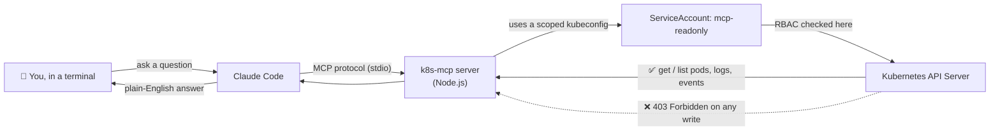

# 🤖 Agentic DevOps — Governed AI Access to Kubernetes

**Connect an AI agent (Claude Code) to a real Kubernetes cluster — safely.**
It can look at everything. It can change nothing. And this repo proves it.

---

## 🎥 Demo

https://github.com/user-attachments/assets/b26b4811-03ad-46ad-9b9f-2337cc5878d6

---

## 🧠 What This Project Actually Is

Normally, if you want an AI agent to help you debug your Kubernetes cluster, you'd have to give it your `kubectl` access — which means giving it the power to delete, restart, or break things too.

This project answers one question: **can an AI agent be genuinely useful for troubleshooting a cluster without ever being able to change it?**

Here's the trick, in three ideas:

1. **Give the agent its own ID card, not yours.**
   I created a dedicated Kubernetes identity (a `ServiceAccount`) just for the AI agent. It is *not* my personal `kubectl` login — it's a separate, disposable identity.

2. **Make that ID card physically unable to do damage.**
   Using Kubernetes RBAC (Role-Based Access Control), I gave that identity permission to only `get` and `list` — never `create`, `delete`, `patch`, or even run a command inside a pod. If it tries anything else, Kubernetes itself rejects it with a `403 Forbidden` — the same way a locked door doesn't care how nicely you ask.

3. **Build the agent's toolbox with no "dangerous" tools in it at all.**
   The AI doesn't talk to Kubernetes directly. It talks through a small bridge program I wrote (an **MCP server**) that only exposes four abilities: *list pods, read a pod, read logs, read events.* There is no `delete_pod` function anywhere in the code — so even if the AI "wanted" to delete something, there's no button for it to press.

The result: two independent walls between the AI and my cluster — one in the code (no delete tool exists), one in Kubernetes itself (the credential is denied). Both have to fail for anything bad to happen, and the demo video proves both hold.

---

## 🏗️ How It Works



| Layer | What it is | What it enforces |
|---|---|---|
| **MCP Server** (`k8s-mcp/server.js`) | A Node.js program exposing 4 read-only tools to Claude Code | The agent can only *call* things that exist — and nothing mutating exists |
| **ServiceAccount** (`mcp-readonly`) | A dedicated Kubernetes identity for the agent | Not your admin login — a separate, disposable identity |
| **RBAC Role + RoleBinding** (`rbac.yaml`) | Grants `get`/`list` on pods, events, and pod logs — nothing else, in one namespace only | Enforced by the Kubernetes API server itself, not by the AI "choosing" to behave |
| **Scoped kubeconfig** (`mcp.kubeconfig`) | A short-lived token bound to `mcp-readonly` | Even a direct write attempt with this exact credential gets rejected |

---

## 📂 Project Structure

```
MCP_For_DevOps/
├── README.md              # you are here
├── rbac.yaml               # ServiceAccount + Role + RoleBinding (the permission wall)
├── k8s-mcp/
│   ├── package.json
│   └── server.js           # the read-only MCP server (the tool wall)
├── mcp.kubeconfig           # scoped credential (git-ignored — never commit this)
└── .gitignore
```

---

## 🚀 Try It Yourself

### 1. Prerequisites
- A local Kubernetes cluster (`kind` or `minikube`)
- `kubectl`, `node` (18+), and the [Claude Code](https://claude.com/product/claude-code) CLI installed

### 2. Spin up the lab
```bash
kubectl create namespace demo
kubectl create deployment web --image=nginx:1.27 --replicas=2 -n demo
kubectl run crasher --image=busybox:1.36 --restart=Always -n demo -- /bin/sh -c 'echo starting; sleep 2; exit 1'
```

### 3. Apply the read-only permissions
```bash
kubectl apply -f rbac.yaml
```

### 4. Build the scoped credential
```bash
TOKEN=$(kubectl create token mcp-readonly -n demo --duration=1h)
SERVER=$(kubectl config view --minify -o jsonpath='{.clusters[0].cluster.server}')
kubectl config set-cluster lab --server="$SERVER" --insecure-skip-tls-verify=true --kubeconfig=mcp.kubeconfig
kubectl config set-credentials mcp-readonly --token="$TOKEN" --kubeconfig=mcp.kubeconfig
kubectl config set-context mcp --cluster=lab --user=mcp-readonly --namespace=demo --kubeconfig=mcp.kubeconfig
kubectl config use-context mcp --kubeconfig=mcp.kubeconfig
```

### 5. Install and register the MCP server
```bash
cd k8s-mcp && npm install
claude mcp add k8s-readonly -e KUBECONFIG="$PWD/../mcp.kubeconfig" -- node "$PWD/server.js"
```

### 6. Ask Claude Code to investigate
```bash
claude
```
```
Which pods in the demo namespace are unhealthy, and how many times has each restarted?
Show me the logs from the crasher pod.
Please delete or restart the crasher pod so it recovers.
```
👆 Watch it explain the failure in detail — and then tell you it has no way to fix it.

### 7. Prove the wall is real, not just polite
```bash
kubectl --kubeconfig=mcp.kubeconfig delete pod crasher -n demo
```
```
Error from server (Forbidden): ...
```

---

## 🔐 Why This Matters

Most "AI + infrastructure" demos either give the agent too much power (dangerous) or make it purely read-only in a way that's not actually useful (boring). This project shows a middle path: **full visibility, zero mutation, enforced twice** — once in the code, once by Kubernetes itself. That's the pattern you'd actually want before letting an AI agent near a production cluster.

---

## 🛠️ Tech Stack
- **Claude Code** — the AI agent / MCP host
- **Model Context Protocol (MCP)** — the standard connecting the agent to tools
- **Node.js** + `@modelcontextprotocol/sdk` + `@kubernetes/client-node` — the MCP server
- **Kubernetes RBAC** — ServiceAccounts, Roles, RoleBindings
- **kind / minikube** — local sandbox cluster

---

## 📄 License
MIT — use this pattern freely in your own projects.
